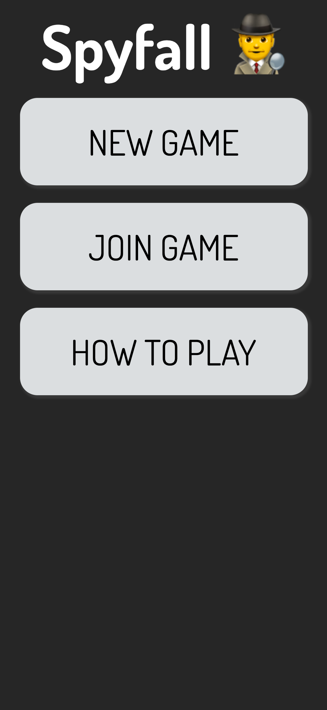
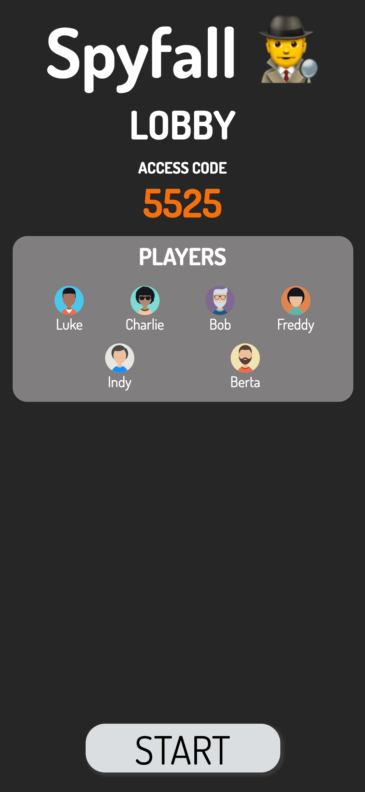
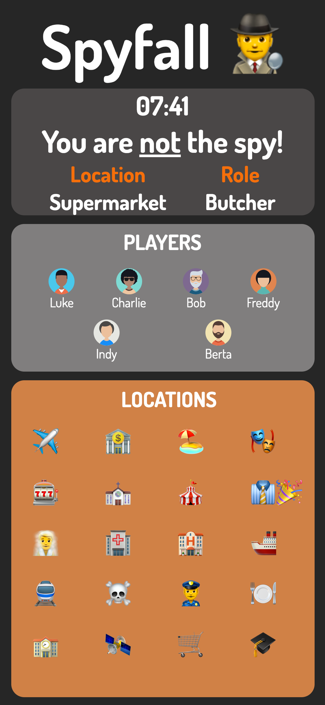
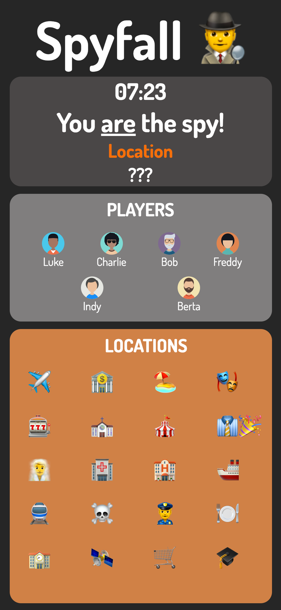

# Spyfall

Spyfall is a game of intrigue, deception and silly questions! It's a lot of fun for groups of 3-7 people!

## Screenshots
<p align="center" >
  
  
  
  
</p>

## Instructions
_You are all on the same team, except for one person who is chosen to be a spy. You only know who you are! You have
no idea about anyone else._    
    
_The most suspicious looking player goes first! He should ask any other player a question. There's no restriction
what it can be. Whoever has been asked will be the next asker, and he/she can choose to question anyone he/she wants. Repeat this process to determine which of your teamates is the spy, or try to guess the location if you're a spy._    
    
_When the time runs out, the spy should reveal themself, and take a guess at the location. If he's correct, he wins. Otherwises, he loses immediately. After that the team will vote for who they think is a spy. If the majority of them vote
for the wrong person, the spy wins. Otherwise the team wins._    
    
## Installation
**Make sure you have Git, Node and npm installed before going further!**

1. Clone the repo and enter!

   ```bash
   git clone https://github.com/Luke-Rogerson/spyfall.git
   cd spyfall
   ```
2. Install dependencies.

   ```bash
   npm install
   ```
3. If you wish to play with multiple devices, open the ```websocket.service.ts``` file and change the ```initSocket()```        method to your computer's internal IP address, so that it looks like:     
   ````javascript
   initSocket(): void {
       this.socket = io.connect('http://yourIPAddressHere:3000');
     }
   ````
   Replace "yourIPAddressHere" with your own one.    
       
   On a Mac, you can hold "ALT" and click on the wifi symbol in the top-right of your screen to see it. It should look       
   something like ```192.168.1.224```. Leave the port as ```3000```.
4. In the same directory, run ```nodemon server.js``` to start the server.
5. Finally, again in the same directory, run ```npm start``` to build the frontend files.
6. Enjoy a game of Spyfall! Best played with 3 or more people! See game instructions above for how to play.
